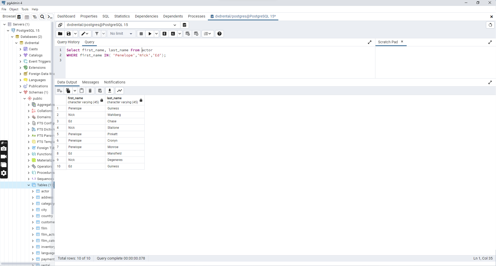
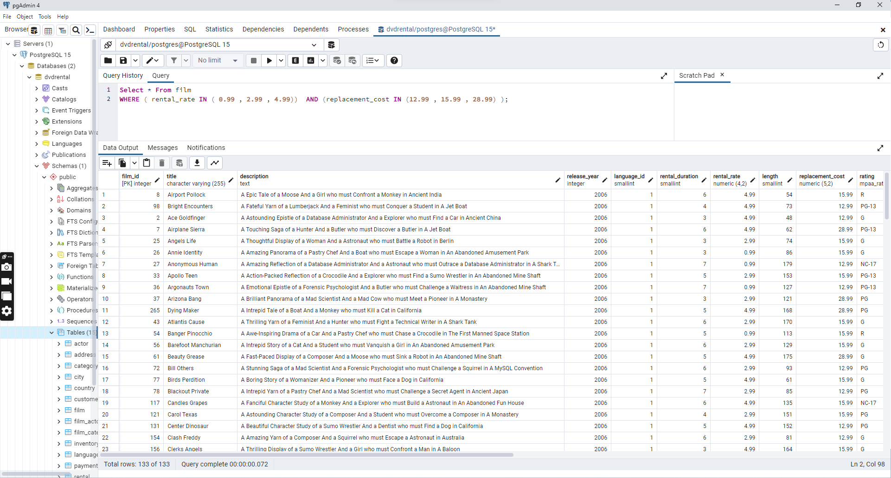

# BETWEEN ve IN
## BETWEEN
Aşağıdaki sorgumuzda **AND** mantıksal operatörü yardımıyla **film** tablosunda bulunan verilerimizi uzunluğu 140 tan küçük eşit **VE** 100 den büyük eşit olmak üzere sıralıyoruz.

```
SELECT * FROM film
WHERE length >= 100 AND length <= 140;
```
Burada temel olarak yaptığımız belirli aralıkta bulunan verileri sıralamak. Bunun BETWEEN ... AND yapısını kullanarak da yapabiliriz.

## BETWEEN AND Söz Dizimi
```
SELECT <sütun_adı>, <sütun_adı>, ... FROM <tablo_adı>
WHERE <koşul>;
```
## BETWEEN Örnek Kullanım
```
SELECT * FROM film
WHERE length BETWEEN 100 AND 140; -- WHERE length >= 100 AND length <= 140 ifadesi ile aynı sonucu verir.
```
Burada dikkat edilmesi gereken nokta 100 ve 140 sınır değerleri aralığa dahildir.

## IN
Şöyle bir senaryo düşünelim, yine film tablosundan uzunluğu 30, 60, 90 veya 120 dakikaya eşit olan verileri sıralayalım.

```
SELECT * FROM film
WHERE length = 30 OR length = 60 OR length = 90 OR length = 120;
```
sorgusuyla verileri aldık ancak burada şöyle bir sorunumuz var peki 4 farklı değer için değil 14 farklı değer için bu sorgumuzu gerçekleştirmek için 14 ayrı OR mantıksal operatörü kullanmamız gerekirdi. Bunun yerine istenilen değerleri liste haline geitip IN anahtar kelimesiyle kullanabiliriz.

## IN Söz Dizimi
```
SELECT <sütun_adı>, <sütun_adı>, ... FROM <tablo_adı>
WHERE <sütun_adı> IN (değer1, değer2, ...);
```
## IN Örnek Kullanım
```
SELECT * FROM film
WHERE length IN (30,60,90,120);
```


